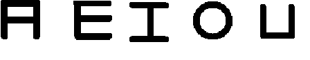
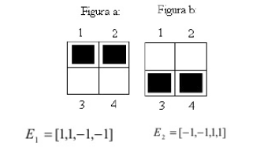
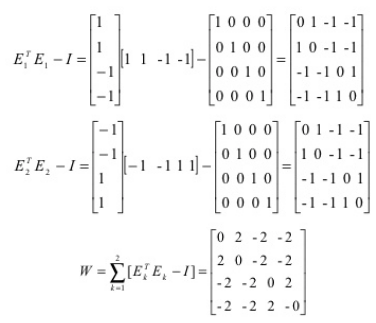
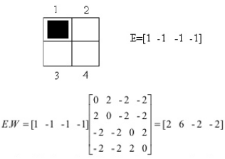
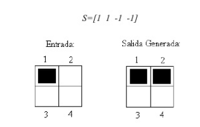
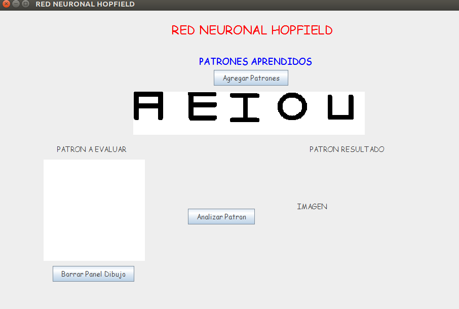
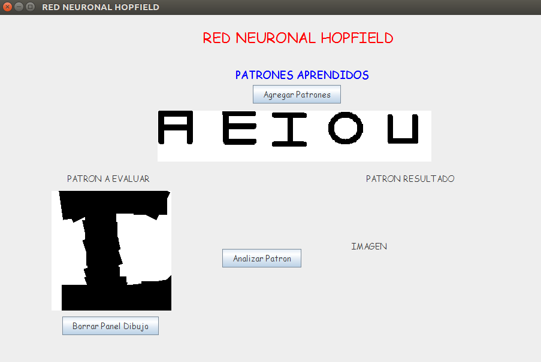
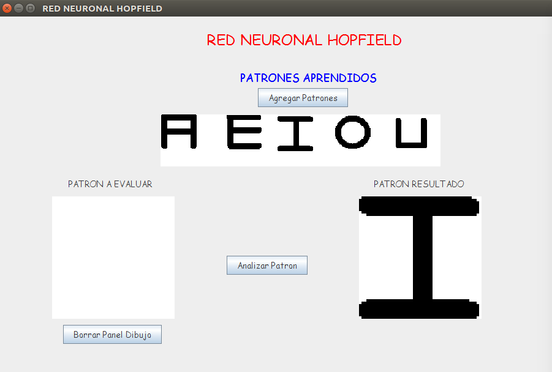
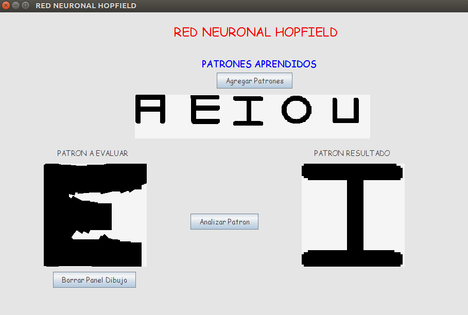
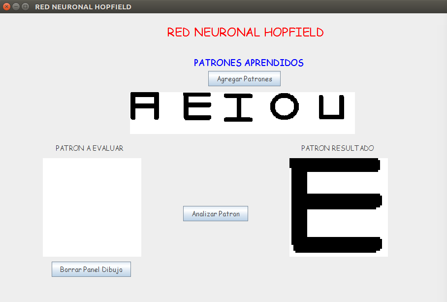

# RNA-Hopfield-Reconocimiento
Reconocimiento de vocales, utilizando la Red Neuronal Artificial (RNA) Hopfield en Java

## ¿Cómo funciona?

Por medio de la RNA Hopfield monocapa (imagen 1) se entrena la red con cada vocal del abecedario (A,E,I,O,U - imagen 2), cada imagen tiene un tamaño de 50x50 pixeles dando un total de 2500 neuronas.

Para el aprendizaje de la red neuronal, se coge cada pixel de cada imagen (50x50=2500 pixeles), el pixel de color negro tiene un valor de 1 y el blanco -1. Para interpretar mejor este tema, en la imagen 3 se muestran dos cuadros de 2x2=4 pixeles o 4 neuronas, donde la figura "a" tiene los pixeles negros arriba y la figura "b" abajo. Y la forma matemática se representa en vectores como se muestra en E1 y E2.

Para conseguir los pesos de la matriz W o el valor de cada conexión de las neuronas, primero multiplicamos el vector transpuesta ET1 por el vector E1 y lo restamos por la matriz identidad (I). Repetimos lo mismo con el vector E2 y nos da una matriz en cada uno. Luego para sacar la matriz W sumamos cada matriz que nos dio como resultado (imagen 4).

Ahora para probar el aprendizaje de la Red, se escoge un valor de entrada como se muestra en la imagen 5 y con su vector E. Luego se multiplica por la matriz W y nos da el vector [2 6 -2 -2]. Para interpretar este nuevo resultado con los vectores de aprendizaje E1 y E2, dividimos cada valor (sin el simbolo - o +) por si mismo y nos da = [2/2 6/6 -2/2 -2/2] = [1 1 -1 -1] = S.

Al final se comparan los vectores de E1 y E2 con S, y se reconoce la figura con el que tenga más patrones o pixeles parecidos (como se muestra en la imagen 6).

## Ejemplo con el software de Reconocimiento de Vocales

En la interfaz Grafica muestra un panel, donde dibujaremos la letra aproximada que queremos que el software reconozca (imagen 7).

Procedemos a dibujarla en este caso la letra I (como se muestra en la imagen 8).

Presionamos el botón "Analizar Patrón" y se muestra en la parte derecha la letra reconocida "I" (como se muestra en la imagen 9)

Ahora el mismo Ejemplo con la letra "E" (imagen 10 y 11).

Sí llego hasta aquí, siéntase libre de comentar o de modificar el código :D.
